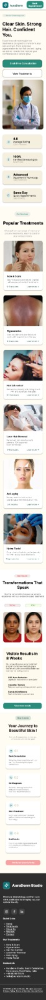
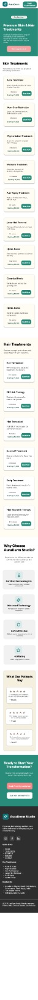
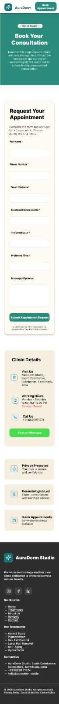

# FUTURE_UX_01
Task 01 - AuraDerm Website Creation
Project Overview

This project is a high-conversion website redesign for a local dermatology clinic (AuraDerm). The objective was to create a mobile-responsive, lead-generation-focused website with a clear value proposition and structured conversion flow.

The design prioritizes trust-building, clarity, and frictionless lead capture.

 Objective

Design a complete website UI including:
Homepage
Service Page
Contact / Lead Capture Page
With strong focus on:
Clear service positioning
Conversion-optimized layout
Strategic CTAs
Lead capture sections
Trust elements

 Target Audience

First-time clinic visitors
Individuals researching dermatology treatments
Users comparing local clinics
Mobile-first users seeking quick consultations
 Conversion Strategy & UX Approach

The homepage was structured intentionally to guide users through a psychological conversion journey:
Clear value proposition above the fold
Service clarity and specialization
Social proof & testimonials
Before/after credibility elements
Strategic CTAs placed at decision points
Lead capture form with minimal friction
The layout reduces cognitive overload while reinforcing trust at each stage.

 Information Architecture

Homepage Flow:

Hero Section → Services Overview → Why Choose Us → Testimonials → Lead Capture Section → Footer CTA

Service Page Flow:

Treatment Overview → Benefits → Process Explanation → FAQs → CTA Section

Contact Page Flow:

Contact Form → Clinic Details → Location Info → Final Conversion CTA

 Mobile Responsiveness

The design maintains:
Clear typography hierarchy
Adequate spacing for readability
Large touch targets for CTAs
Structured stacking for mobile screens
The layout ensures usability across device sizes.

 Design System

Warm neutral background for comfort
Soft green accents to reinforce medical trust
Rounded components for approachability
Clear CTA contrast for action visibility
Consistent spacing system

 Key UX Decisions

✔ Above-the-fold clarity to reduce bounce rate
✔ Multiple CTA placements for different user readiness levels
✔ Testimonials positioned before lead form to increase trust
✔ Simplified contact form to reduce drop-offs
✔ Clear service segmentation to avoid confusion

Screens

 Future Improvements

Live chat integration
Online appointment scheduling
Payment gateway integration
Patient portal access

Live Figma Prototype

View the complete high-fidelity design and interactive booking flow here:
https://www.figma.com/design/kEhk4GFivGHmmlVX9PJe90/AuraDerm-Studio?node-id=8-119&t=xvcskjpd4m6VWszT-1